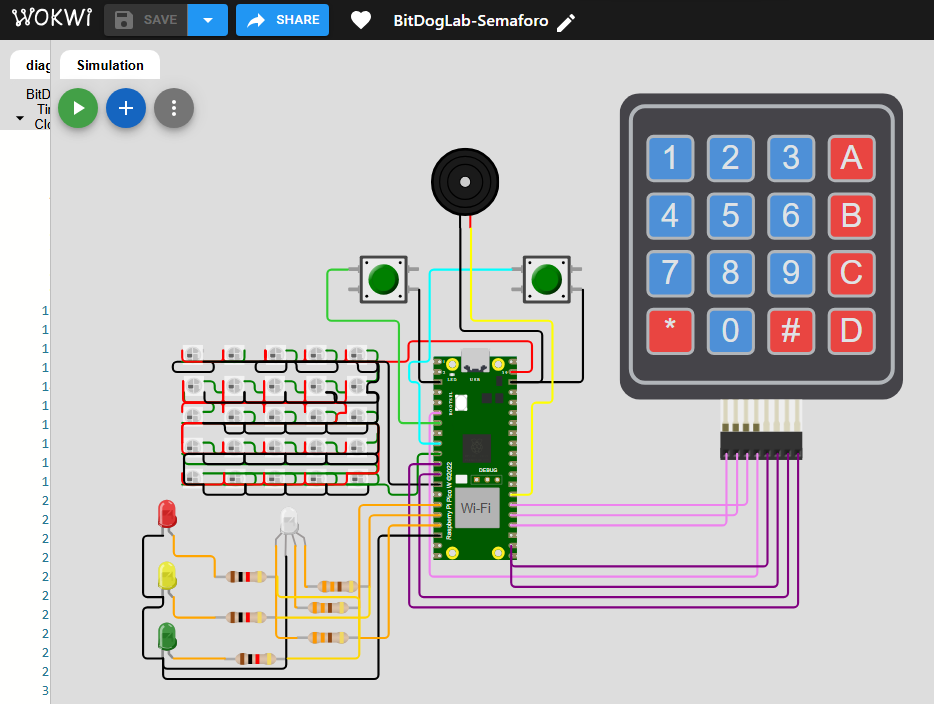
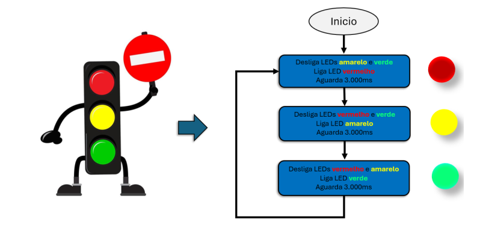
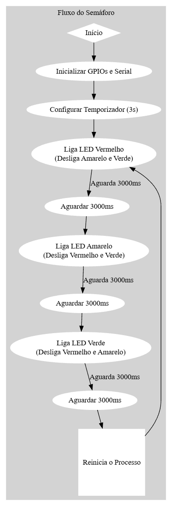

# **BitDogLab-Semaforo**

**Tarefa 1 - Temporizador Periódico (Semáforo)**


 **Controle de Temporizador Periódico no RP2040 - BitDogLab**

Este projeto demonstra o uso de um **temporizador periódico (`add_repeating_timer_ms()`)** no **microcontrolador RP2040**, utilizando a placa **BitDogLab**. A implementação consiste em um **sistema de semáforo**, onde os LEDs alternam suas cores em intervalos fixos, simulando um ciclo real de trânsito.

---

## Objetivo do Projeto

O principal objetivo deste projeto é demonstrar o uso da função `add_repeating_timer_ms()` do Pico SDK para criar um temporizador periódico no Raspberry Pi Pico W. Esse temporizador é responsável por alternar os estados dos LEDs conforme um ciclo de semáforo.

O sistema segue a seguinte lógica:
- O LED vermelho inicia ligado por 3 segundos.
- O LED amarelo acende e permanece ligado por 3 segundos.
- O LED verde acende e permanece ligado por 3 segundos.
- O ciclo se repete continuamente.

Este projeto é útil para a compreensão de conceitos como temporização, manipulação de GPIOs e controle de fluxo de execução em sistemas embarcados.

---

## Componentes Utilizados

- **Microcontrolador**: Raspberry Pi Pico W (BitDogLab)
- **LEDs**: Vermelho, Amarelo e Verde
- **Resistores**: 330Ω para cada LED
- **Software**: VS Code + Pico SDK + Simulador Wokwi

---

## Bibliotecas Utilizadas e Sua Importância

O código deste projeto utiliza as seguintes bibliotecas essenciais para o funcionamento correto no Raspberry Pi Pico W:

### `#include <stdio.h>`
A biblioteca padrão de entrada e saída do C. É utilizada principalmente para permitir a comunicação serial com o computador através da função `printf()`, que imprime mensagens no console, facilitando a depuração e monitoramento do sistema.

### `#include "pico/stdlib.h"`
A biblioteca padrão do SDK do Raspberry Pi Pico. Contém funções essenciais para manipulação de GPIOs, delays (`sleep_ms()`), configuração de hardware e comunicação serial. Sem essa biblioteca, não seria possível inicializar e controlar os LEDs.

### `#include "hardware/timer.h"`
Esta biblioteca fornece suporte para o uso de temporizadores de hardware no RP2040. É fundamental para a implementação do temporizador periódico (`add_repeating_timer_ms()`), que gerencia o tempo de troca dos LEDs no semáforo. Sem essa biblioteca, seria necessário implementar a temporização manualmente, o que resultaria em um código menos eficiente.

--- 

## **Funcionalidades Implementadas**

### **Atividade 1: Temporizador Periódico (Semáforo)**

- Utiliza a função **add_repeating_timer_ms()** para alternar os LEDs do semáforo (**vermelho, amarelo e verde**) a cada **3 segundos**.
- Implementação da função **repeating_timer_callback()** para controle dos estados dos LEDs.
- Impressão de mensagens na **porta serial** a cada **1 segundo**.
- Simulação e testes com **LED RGB na ferramenta BitDogLab**.

---

##  **Tecnologias e Conceitos Utilizados**

- Uso de **temporizadores periódicos** no **RP2040**.
- Manipulação de **GPIOs para controle dos LEDs**.
- **Mensagens seriais** para monitoramento do sistema.
- Integração com o **simulador Wokwi** para validação do código.

### Simulador para a prototipação do projeto

[Simulador no WOKWI deste projeto](https://wokwi.com/projects/421920880908973057 "Simulador no WOKWI deste projeto")

[](https://github.com/hsantosdias/BitDogLab-Semaforo/blob/main/imgs/imagem_simulador.png?raw=true "Diagrama de conexões")


### **Fluxograma do projeto**

#### **Fluxograma simplificado para a execução do projeto**


> Diagrama fornecido pelo Professor

[](https://github.com/hsantosdias/BitDogLab-Semaforo/blob/main/imgs/fluxograma_simplificado.png?raw=true "Diagrama simplificado para a construção do projeto Semaforo")

#### **Fluxograma completo para a construção do codigo do projeto**

[](https://github.com/hsantosdias/BitDogLab-Semaforo/blob/main/imgs/fluxograma_principal.png?raw=true "Fluxograma do projeto")

---

## **Organização do Código**

O código está estruturado e comentado para facilitar a compreensão e reutilização.

 Código-fonte do semáforo
 Documentação complementar
 Testes para validação das funcionalidades

---

## **Demonstração do professor**

Vídeo demonstrativo do funcionamento do projeto(Video do Professor):
 **[Semáforo no Wokwi - Vídeo](https://www.dropbox.com/scl/fi/6w37qxzdq4ytljqvqzr6h/2025-01-25-17-48-11.mkv?rlkey=yjj1iqcfkx444xigglaxqw81e&dl=0)**

---

## **Requisitos**

- **Placa de desenvolvimento BitDogLab (RP2040)**
- **LEDs** (Vermelho, Amarelo, Verde)
- **Resistores de 330Ω para cada LED**
- **VS Code com Pico SDK e Simulador Wokwi** configurados

---

## Como Executar o Código

### Requisitos

- Placa de desenvolvimento Raspberry Pi Pico W (BitDogLab)
- Ambiente de desenvolvimento: VS Code + Pico SDK
- Simulador: Wokwi

```bash
git clone https://github.com/hsantosdias/BitDogLab-Semaforo.git
```
